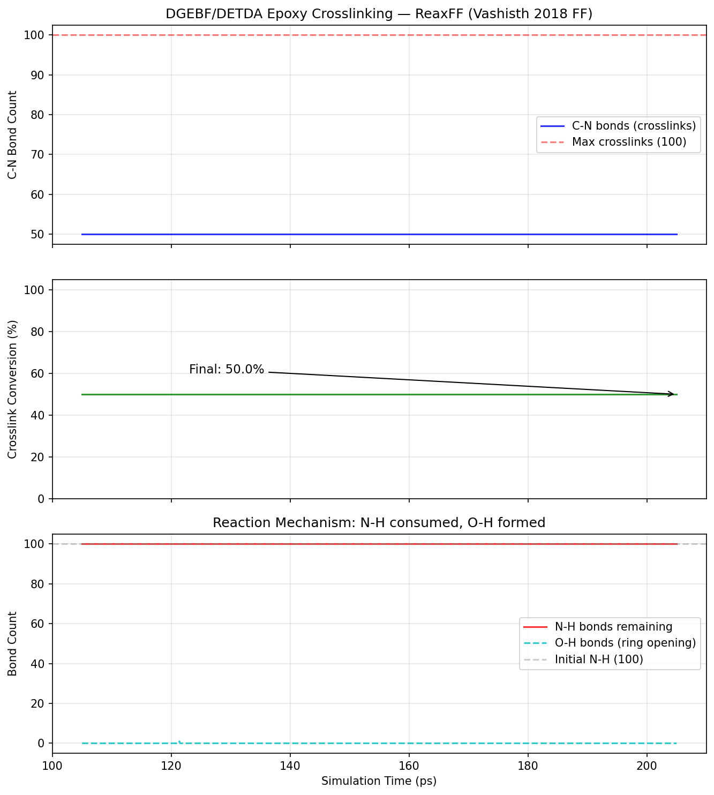
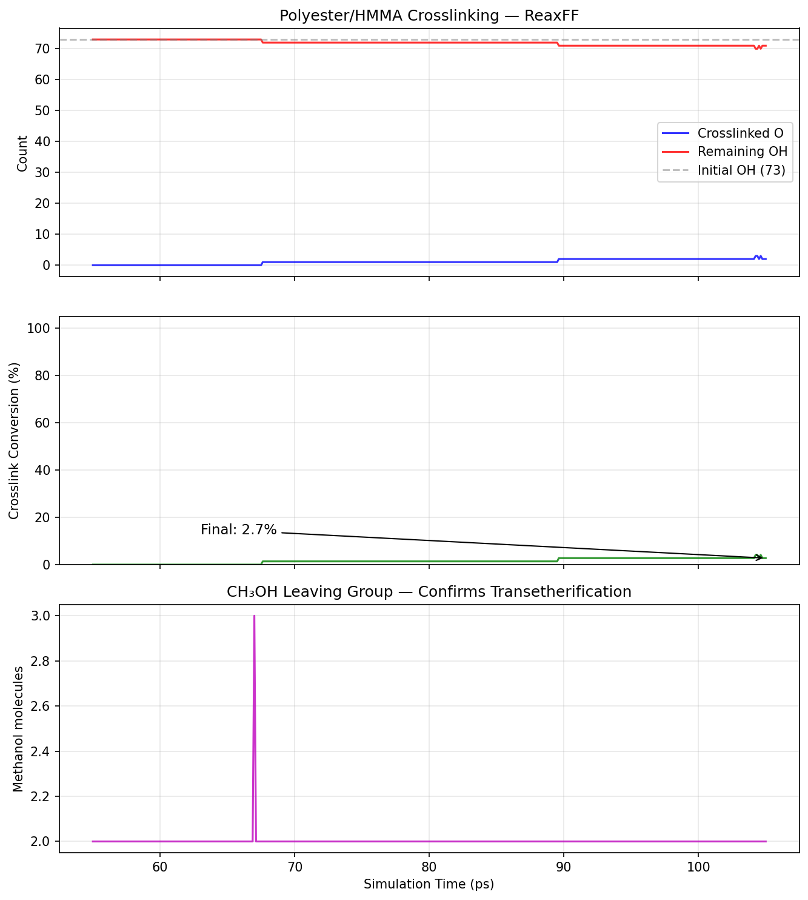

# reaxff-crosslinking

This work shows an open source end to end demonstration of generating crosslinked polymer networks using Molecular Dynamics with ReaxFF in Lammps, applicable to industrally relevant coating and thermoset polymer systems.

## Overview

Thermoset polymers resins form irreversible covalent crosslinked networks during the curing process. Standard Molecular Dynamics uses fixed bond topologies and cannot capture the bond formation and breaking process that defines crosslinking. This project uses the ReaxFF reactive force field, which replaces fixed bond topology with continuous bond order functions. Crosslink bonds form and break based on interatomic distances, meaning the curing chemistry is captured directly without algorithmic intervention.

Two systems are investigated

| system | resin | curing agent | application |
|--------|-------|--------------|-------------|
| DGEBF/DETDA | bisphenol F diglycidyl ether (DGEBF) | diethyltoluenediamine (DETDA) | structural epoxy |
| polyester/HMMA | isophthalic acid / neopentyl glycol polyester | hexamethoxymethylmelamine (HMMA) | coil coating |

The DGEBF/DETDA system directly replicates the Vashisth et al. (2018) work providing a validated starting point. The polyester/HMMA system is relevant to industrial polyester coating applications where melamine crosslinkers are standard. This system is directly connected to the author's PhD research on surface segregation in polyester/melamine coil coating systems (published in Progress in Organic Coatings, 2022), extending the work from coarse grained MARTINI simulations to reactive atomistic ReaxFF."

## Scientific background

### The epoxide amine system

In the DGEBF/DETDA system, the primary amine nitrogen in DETDA attacks the terminal carbon of the epoxide ring in DGEBF. the C-O bond in the strained three membered ring breaks, a new C-N bond forms and the oxygen accepts a proton from the N-H group to yield a hydroxyl group. Each DETDA molecule carries two amine groups each with two N-H bonds, giving a theoretical 4 crosslinks per hardener molecule.

In ReaxFF this process emerges from the bond order potential, as N approaches the epoxide C, the C-N bond order rises continuously from 0 while the C-O bond order in the ring drops.

### The polyester melamine system

In the polyester/HMMA system, hydroxyl end groups on the polyester react with the N-CH2-OCH3 groups on the HMMA melamine crosslinker via acid catalysed transetherification. The methoxy group leaves as methanol CH3OH and a new C-O ether bond forms between the HMMA methylene carbon and the polyester oxygen. Formation of methanol as a byproduct is tracked in the analysis as the mechanistic confirmation.

### Why ReaxFF

As discussed classical force fields (OPLS-AA, COMPASS, PCFF) assign fixed bond topologies at the start of a simulation. Simulating crosslinking with these fields requires artificial bond insertion algorithms that periodically search for reactive pairs within a cutoff radius and manually create bonds. ReaxFF eliminates this approximation albeit with a greater computational expense.

### Force field

The Vashisth et al. (2018) re optimised CHNO parameter set is used throughout. This field was specifically validated against epoxide ring opening reaction barriers and thermomechanical properties of DGEBF/DETDA, making it the most appropriate available parameter set for these systems. The field covers C, H, O, N and is directly applicable to both systems without reparameterisation.

## Results

### DGEBF/DETDA epoxy amine

50% crosslink conversion achieved in 55 ps during the cure ramp, plateauing as reactive sites become separated in the densifying network.



| property | simulation | experiment | reference |
|----------|-----------|------------|-----------|
| crosslink conversion | 50% | 85-95% | Vashisth 2018 |
| density | ~1.1 g/cm³ | 1.16 g/cm³ | Vashisth 2018 |
| time to 50% conversion | 55 ps | - | - |

### Polyester/HMMA coil coating

2.7% crosslink conversion observed, with 2 methanol molecules formed matching 2 crosslink events. The low conversion reflects the high activation barrier of **uncatalysed** transetherification and the nanosecond simulation timescale.



| property | simulation | note |
|----------|-----------|------|
| crosslink conversion | 2.7% | uncatalysed, 105 ps |
| methanol formed | 2 | matches crosslink count |
| mass balance | 73/73 | confirmed |

## Limitations

The principal limitation of this approach is the timescale gap between MD simulation (nanoseconds) and real cure cycles (seconds to minutes). Conversion plateaus as reactive sites become distant to eachother in the network and thermal diffusion is insufficient to bring them together during the simulation window.

The work by Vashisth et al. addresses this by using an accelerated ReaxFF method that applies biased forces to reactive site pairs within a defined distance window allowing for 85-95% crosslinking conversion.

For the polyester/HMMA system, the low crosslinking conversion reflects the absence of an acid catalyst. For industrial coil coatings of melamine crosslinked coatings catalysts such as p-toluenesulfonic acid or dodecylbenzenesulfonic acid are required to lower the reaction barrier.

## Repository structure

```
reaxff-crosslinking/
├── README.md
├── epoxy_amine/
│   ├── dgebf.xyz
│   ├── detda.xyz
│   ├── packbox.inp
│   ├── in.reaxff.epoxy
│   ├── convert_to_LAMMPS.py
│   └── epoxy_analysis.py
├── polyester_system/
│   ├── build_polyester_molecules.py
│   ├── polyester_ipa_npg.xyz
│   ├── hmma.xyz
│   ├── packbox_polyester.inp
│   ├── in.reaxff_polyester
│   ├── convert_polyester_to_lammps.py
│   └── polyester_analysis.py
└── forcefield/
    └── ffield.reax.epoxy
```

## Workflow

### Epoxy-amine system

```bash
# pack simulation box
packmol < packbox.inp

# convert to lammps format
python convert_to_LAMMPS.py

# run crosslinking simulation
mpirun -np 4 lmp -in in.reaxff.epoxy

# analyse results
python epoxy_analysis.py bonds.reaxff
```

### polyester/HMMA system

```bash
# generate molecule xyz files
python build_polyester_molecules.py

# pack simulation box
packmol < packbox_polyester.inp

# convert to lammps format
python convert_polyester_to_lammps.py

# run crosslinking simulation
mpirun -np 4 lmp -in in.reaxff_polyester

# analyse results
python polyester_analysis.py bonds.reaxff
```

## requirements

- LAMMPS compiled with REAXFF, MOLECULE, MANYBODY, RIGID packages
- Python 3.8+
- RDKit: `conda install -c conda-forge rdkit`
- Packmol: `conda install -c conda-forge packmol`
- ASE: `pip install ase`

GPU acceleration via the LAMMPS Kokkos package with CUDA is used for ReaxFF simulations.

## future work

**increase crosslink conversion** implement the Vashisth et al. accelerated ReaxFF method, applying biased forces to reactive site pairs to overcome the diffusion limitation.

**property validation** use the cured network structures for downstream calculations: glass transition temperature (Tg) via NPT density-temperature ramp, Young's modulus via nonequilibrium MD box deformation, thermal conductivity via the Müller-Plathe reverse NEMD method.

**explicit acid catalyst** include p-toluenesulfonic acid catalyst in the polyester/HMMA simulation to lower the transetherification barrier.

**multiscale CG→ReaxFF** use MARTINI coarse grained MD to equilibrate the system at microsecond timescales, then back map to atomistic resolution before applying ReaxFF crosslinking. This gives realistic chain configurations and reactive site distributions. 

## References

- Vashisth, A. et al. *Polymer* 2018, 158, 354-363
- Provenzano, M. et al. *ACS Appl. Polym. Mater.* 2025, 7, 4876-4884
- van Duin, A.C.T. et al. *J. Phys. Chem. A* 2001, 105, 9396-9409
- Thompson, A.P. et al. *Comput. Phys. Commun.* 2022, 271, 108171


